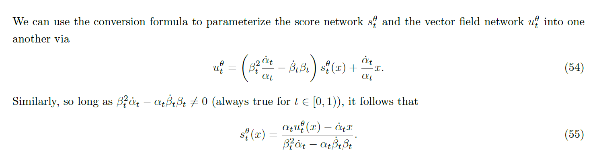
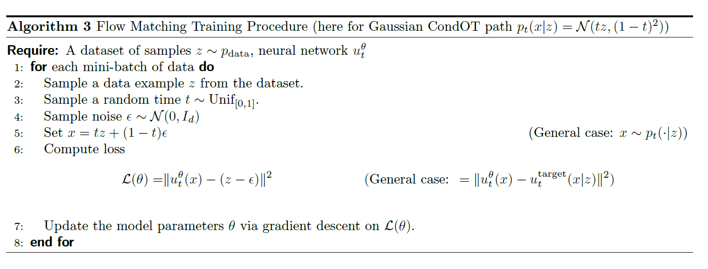

# 6.18

白天花费了许多时间, 请教郑老师关于MIT课程前三章是如何在数学上定义起始的点到末态点之间的过程的,认真探讨了诸如路径,随机过程的问题. 我们认识到样本空间是由选取路径决定的,和时间这个参数一起构成一个定义域; 映射是一个路径; 值域是所有点在$R^d$上的取值. 把概率测度分配给样本空间中的元素后,我们就有了随机过程,也就能从条件速度场推导出边缘速度场. 郑老师还指出,速度场方程必须满足连续性方程,这是我没有想过的. 不过,考虑到高斯过程就已经足够模拟我们的生成任务了,所以我也没有在顾虑. 聆听郑老师的教诲,深切体会到什么事"真心想讲懂你",不禁为其耐心和清晰的思维所折服.

为了弥补白天的时间进度,遂晚上继续加班.继续看完了第四章.同时补了一下第三章关于flow-matching的内容.原来,flow-matching 和score-matching是两种训练手段. 一个是:

>   How the **sample actually moves** over time, like a particle flowing through space.

It’s the **real velocity** of a sample $x = \alpha_t z + \beta_t \epsilon$, as $t$ changes.

Think: “Where is this particle going at this moment?”

------

另一个是

>   Which direction **increases probability** the most at point $x$.

It’s the **gradient of log-probability**, called the **score**.

Think: “If I want to move toward regions of higher density, which direction should I go?”

是两种很好的训练目标. 其中score-matching更复杂更慢但更通用.

同时,在高斯路径下,由于:

这二者是相同的!(太好了,我大概也就只用用高斯路径)

不论是score-matching 或是flow-matching核心对于Loss function的处理都是一样的: 
$$
grad(L_{CFM}= L_{FM} \ ,L_{SM}=L_{CSM})
$$
这里conditional 的flow matching 和score matching都是可以用数据近似的! 所以, 我们有了训练流程:

第五章,看不太懂,特别是classifier free的情况.