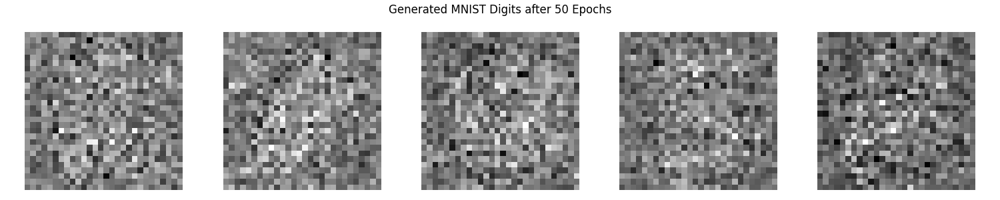
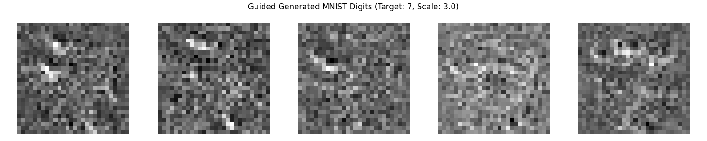

# 6.29

完成了MNIST的FM的generation 和classification; 在AI的帮助下,写了一个integrated version:试图一classifier作为引导,生成某个特定的数字.

结果是非常差的:

这是general 的生成

这是guided的生成,希望生出7

想了一下,可能的原因有:

1.   classifier不太行:mnist的所有数据都太"逼真"了;导致classifier无法在比较混乱的位置(比如一开始都是噪声的时候生成图片)有效引导生成
2.   用mlp搭的NN不太行:mlp的表达能力在图片的情况下并不理想.

源代码附在今天的文件夹中.mnist_classification是从jupyter notebook中直接摘下来的, 有许多调试的代码