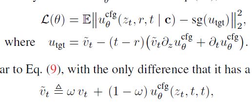

## 📁 Project Structure Overview

This project implements a generative Mean-Flow model trained on the MNIST dataset using classifier-free guidance (CFG) and a Gaussian diffusion process. This project is based on the a program which contains a Flow matching model

Some key changes I made in this project:

-   common_config:compared with the underlying project, I add a path save and load util function for better replication. It’s also need for visualization. As the logic of $u^{CFG}$ is different from instantaneous version, it directly trained on a specific weight.
-   main.py: new visualization logic, which multiple models are loaded for simulation. steps for simulation are set to 1 by default.
-   trainer.py: modified train function , for specific guidance- weight and a new loss function (see the picture below); plus, I choose to save the model for every 500 epochs.
-   model.py:modified model layers , for embedding and adaption for both t and r
-   sampler.py:create a function called TimeSample for sampling t and r   I also set the equivalent rate, where $r = t$ (by default 0.5) , as well as sample modes : “lognorm” or “unif” for (1 and 0) here I set $\mu = -0.4 ; \sigma = 1$ for lognorm.
-   

Below is a breakdown of each module in the codebase

---

### `main.py`

The main script that orchestrates the training and generation pipeline. It initializes the MNIST sampler, constructs the conditional probability path, builds the UNet model, trains it using the CFGTrainer, and finally simulates and visualizes generated samples under varying guidance scales. This file serves as the primary entry point for experimentation.

---

### `config_common.py`

Contains shared configuration and utility functions. Defines the computing device (`cuda` or `cpu`) and a helper function `model_size_b()` for estimating the memory footprint of a model. This centralized configuration ensures consistency and simplifies device-agnostic programming throughout the codebase.

---

### `sampler.py`

Defines the data sampling abstraction used throughout the project. The `Sampleable` base class enforces a standard interface for distributions. `IsotropicGaussian` samples from a simple Gaussian prior, while `MNISTSampler` handles loading, preprocessing, and random sampling from the MNIST dataset. These classes are essential for training and sampling workflows.

---

### `model.py`

Implements the neural network architecture used to approximate the conditional vector field. The core model is a UNet-like structure enhanced with Fourier time encodings and label embeddings. Residual layers are used throughout to stabilize training and enable the model to condition effectively on both time and class labels.

---

### `trainer.py`

Provides training routines for the vector field model. Includes a base `Trainer` class and a specialized `CFGTrainer` for classifier-free guidance. The trainer handles optimization, label masking (null-label replacement), and loss computation. It encapsulates all logic needed to fit the model to the conditional path data.

---

### `ode_path.py`

Contains core diffusion logic, including time-dependent interpolation functions (`Alpha`, `Beta`), the `GaussianConditionalProbabilityPath`, and the `CFGVectorFieldODE`. These classes define the mathematical structure of the generative process, including forward sampling, velocity field construction, and analytical score functions for training and simulation.

---

### `simulator.py`

Defines the numerical simulation process used to generate samples from the trained model. Includes a base `Simulator` interface and an `EulerSimulator` implementation. This module integrates the ODE over time using the learned vector field to transform Gaussian noise into data-like samples. It also supports trajectory visualization for debugging or inspection.

251cx